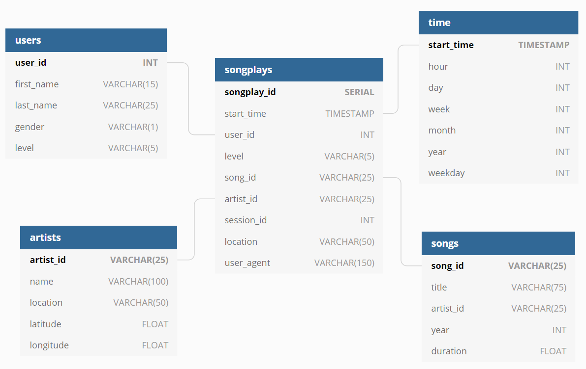

# Data Warehouse Design Using AWS S3 and AWS Redshift

## Quickstart:
1. Update the 'dwh.cfg' file:
- Add in your AWS KEY
- Add in your AWS SECRET
- Add in the other fields for cluster naming, database naming, usernames and passwords

2. Create credentials for AWS
- Create IAM user (eg. dwhuser)
- Create IAM role (eg. dwhRole) and assign AmazonS3ReadOnlyAccess access rights
- Get ARM
- Create and Run Redshift Cluster

Step 2 can be done by running 'AWS Setup.ipynb' file. Complete steps 0 - 4.

3. Update the 'dwh.cfg' file:
- Insert the value received in Step 2.2 of 'AWS Setup.ipynb' for DWH_ENDPOINT as the \[CLUSTER\] HOST
- Insert the value received in Step 2.2 of 'AWS Setup.ipynb' for DWH_ROLE_ARN as the \[IAM_ROLE\] ARN

4. Run the following commands in the CLI:
- 'python create_tables.py' to create the tables in AWS Redshift database
- 'python etl.py' to extract, transform and load the data to the AWS Redshift database

### Requirements
- python3
- boto3
- pandas
- psycopg2

## Overview:
In this project, Sparkify, an online music app provider, requires a distributed database specifically for it's data analytics. This project will extract the data (JSON) from an S3 bucket to a staging area on AWS Redshift. It is then transformed and loaded into a star schema on AWS redshift across 4 clusters.
Tecnologies used includes Python, SQL, AWS S3 & AWS Redshift.

## Data Source:
Current data is collected and stored in JSON format. Current data is located in AWS S3 buckets:
- s3://udacity-dend/song_data - data about the songs ({"artist_id":{"0":"AR8IEZO1187B99055E"},"artist_latitude":{"0":null},"artist_location":{"0":""},"artist_longitude":{"0":null},"artist_name":{"0":"Marc Shaiman"},"duration":{"0":149.86404},"num_songs":{"0":1},"song_id":{"0":"SOINLJW12A8C13314C"},"title":{"0":"City Slickers"},"year":{"0":2008}})
- s3://udacity-dend/log_data - event data collected ({"artist":"Sydney Youngblood","auth":"Logged In","firstName":"Jacob","gender":"M","itemInSession":53,"lastName":"Klein","length":238.07955,"level":"paid","location":"Tampa-St. Petersburg-Clearwater, FL","method":"PUT","page":"NextSong","registration":1540558108796.0,"sessionId":954,"song":"Ain\'t No Sunshine","status":200,"ts":1543449657796,"userAgent":"\\"Mozilla\\/5.0 (Macintosh; Intel Mac OS X 10_9_4) AppleWebKit\\/537.78.2 (KHTML, like Gecko) Version\\/7.0.6 Safari\\/537.78.2\\"","userId":"73"})
- s3://udacity-dend/log_json_path.json

## Analytics requirements:
Sparkify requires analysis on its song plays. 

## Model suggestion:
The current star schema has been suggested, which would allow for analysis on the song plays and would allow for further segmentation and filtering based on the dimensions:

### Fact Tables:
- song_plays (event data of each song play)
### Dimension Tables:
- users (what are the demographics of their users)
- artists (which artists are more popular)
- songs (which songs are more popular)
- time (how frequently are users interacting with their app)

## AWS Redshift Optimization
It was decided to further optimize the database by creating appropriate DISTKEY & SORTKEY's. 

DISTKEY was applied on the following tables & columns respectively:
- songplays (user_id)

SORTKEY was applied on the following tables & columns respectively:
- songplays (songplay_id)
- users (user_id)
- songs (song_id)
- artists (artist_id)
- time (start_time)

A distribution style of ALL was applied to the following tables, due to the small size of each table:
- users
- artists
- time
